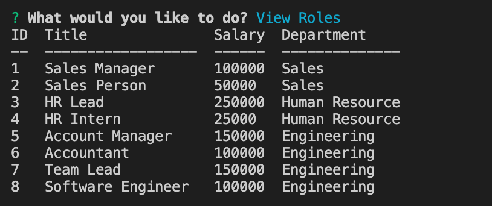

# Employee-Management-System (EMS)

## Description 

This repository consists of code for an Employee Management System(EMS). This is a command line application which allows the user to do the following:

- Add New Department
- View Departments
- Add New Role
- View Roles
- Add New Employee
- View Employee
- Update Employee Role
- View employees by manager
- Update employees's manager

npm inquirer package is used for getting user input through command line and npm mysql package is used to connect to database and perform sql operations

Git is used for version controlling and for periodic commits to Gitlab.

## Installation

Execute ``` npm install ``` command in terminal(Mac) or command promt(windows) to install all needed packages to run this application successfully.

Run ``` npm run start ``` command in terminal(Mac) or command promt(windows) to start the application.


## Screenshots
<br>
<br>
<br>
<br>